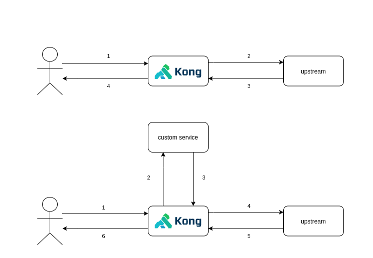

# Kong plugin reroute-before

When a request to the upstream service needs to be redirected to a custom backend **before** to send it to the upstream.

## Configuration Reference

### Enabling the plugin on a Service, Route or Globally
```json
curl -X POST 'http://<admin-hostname>:8001/<enabling-location>' \
--header 'Content-Type: application/json' \
--data-raw '{
    "name": "reroute-before",
    "config": {
        "run_on_preflight" : false,
        "before" : [{
            "header_name" : "X-Custom-Header",
            "header_value" : "header-value",
            "url" : "http://custom.url"
        }]
    }
}'
```

where `<enabling-location>` can be:

|     local    |                value               |
| ------------ | ---------------------------------- |
| on a Service | `/services/<service-name>/plugins` |
| on a Route   | `/routes/<route-name>/plugins`     |
| globally     |  `/plugins`                        |


## Usage

After enabling on a route/service/globally, a request will be checked if a header value match with the configuration. If it matches, then the plugin will made a request to the URL configured sending the original request to the custom endpoint. The next step is get the response from custom service and send it to the upstream service.


